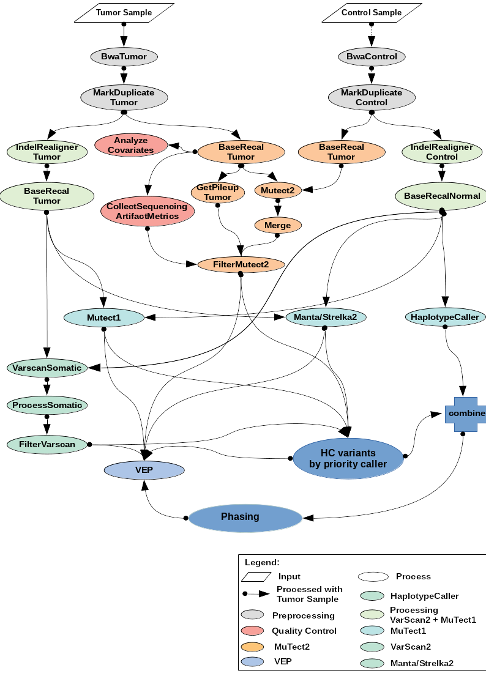

# NeoEpitope predictions Nextflow Pipeline
Pipeline takes fastq file from Tumor and Normal samples and optionally RNAseq from tumor
to predict neoepitopes.

The pipeline uses the following tools:
* MuTect2
* MuTect1
* VarScan2
* Strekla2/Manta
* OptiType
* HLAHD
* pVACseq (netMHCpan, netMHCIIpan, mhcflurry)
* NeoFuse
* mixMHC2pred
* mixcr

It outputs a vcf files with the annotated and filtered SNPs and Indels, which
where called with each of the callers and a high confidence vcf file (hc) in
which only variants that were called by a minimum of 2 of the callers are listed.
All vcf files are annotatd with VEP. In addition the germline variants are called
using HaploTypeCaller and a phased vcf for pVACseq is generated as well.
HLA class I and class II alleles are predicted with OptiType and HLAHD.
Class I and Class II neoepitopes are predicted with pVACseq using netMHCpan,
netMHCIIpan and mhcflurry. In addition mixMHC2pred is used as complement Class II
neoepitope predictor. Fusion neoantiges are predicted with NeoFuse.
CSiN immunogenicity score is reported for Class I, Class II and combined neoepitopes.
A GBM model is be used to predict immunogenicity scores for MHC class I single nucleotide
variant (SNV) neoantigens 8-11 amino acid residues in length. https://github.com/vincentlaboratories/.
Finally mixcr is run to predict TCRs.




## 1. Installation

## 1.1 Singularity Image

To run the pipeline using singularity, the image has to be build:
```
singularity build coolNameHere.sif docker://icbi/wes
```
## 1.2 Software
To run the pipeline local, the required software has to be installed:
* FASTQC        (Version >= 0.11.8)
* FASTP         (Version >= v0.20.1)
* JAVA7 		(Version 1.7)
* JAVA8 		(Version 1.8)
* BWA 			(Version 0.7.17)
* SAMTOOLS 		(Version 1.9)
* PICARD 		(Version 2.22.1)
* GATK3 		(Version 3.8-0)
* GATK4 		(Version 4.1.4.1)
* VARSCAN 		(Version 2.4.3)
* MUTECT1 		(Version 1.1.7)
* BAMREADCOUNT 	(Version 0.8.0)
* VEP 			(Version v99)
* BGZIP
* TABIX
* BCFTOOLS
* MANTA
* STRELKA


## 1.2 References
the Pipeline requires different references and databases:

References:
* RefFasta - reference.fa - Reference Genome; FASTA file
* RefIdx - reference.fai - Referene Genome Index, FAI file
* RefDict - reference.dict - Reference Genome Dictionary, DICT file
* BwaRef - reference.{amb,sa,ann,pac,bwt} - Reference Genome prepared for BWA mem
* VepFasta - reference.toplevel.fa - Reference genome; ENSEMBL toplevel
* YaraIndex - hla index for yara mapper
* HLAHDFreqData
* HLAHDGeneSplit
* HLAHDDict
* AnnoFile - gencode annotation GTF


Databases:
* MillsGold/Idx - Mills_and_1000G_gold_standard.indels.vcf/idx -  Gold standard Indels database, VCF file, IDX File
* 1000G high confidence SNPs - VCF + IDX
* HapMap VCF + IDF
* Cosmic/Idx - CosmicCodingMuts.vcf - Cosmic conding mutations, VCF file, IDX file
* DBSNP/Idx - Homo_sapiens_assembly.dbsnp.vcf/idx - SNPS, microsatellites, and small-scale insertions and deletions, VCF file, IDX file
* GnomAD/Idx - small_exac_common_3.vcf/idx - exonix sites only for contamination estimation from GATK, VCF file, IDX file
* GnomADfull VCF + IDX
* KnownIdenls/Idx - Homo_sapiens_assembly.known_indels.vcf/idx - Known Indels from GATK resource Bundle, VCF file, IDX file

see also:
<https://gatk.broadinstitute.org/hc/en-us/articles/360036212652-Resource-Bundle>
<https://console.cloud.google.com/storage/browser/genomics-public-data/resources/broad/hg38/v0/>
<ftp://gsapubftp-anonymous@ftp.broadinstitute.org/bundle/>

## 2. Usage
Before running the pipeline, the config files has to be edited. In the
params.config parameters like references, databases and default settings are defined. The sge.config
is a template for the configuration to run the pipeline on cluster.

Every parameter can be edited in the params file or with the command lind by using --NameOfTheParameter given in the params.config.
References, Databases and Software should be edited in the params.config.

```
nextflow run wes.nf "--readsTumor <tumorFastq> --readsNormal <nomralFastq>"|--batchFile <batchFile.csv>" [--single_end]
```
#### Singularity
The singularity mode has to be enabled in the params.config file and the path to the image has to be edited.

#### Single-end reads:
**--single_end:** sets parameter to TRUE (default false)

#### Mandatory arguments:
**--readsTumor:** 		 reads_{1,2}.fastq or reads_1.fastq; 		 paired-end or single-end reads; FASTA
**--readsNormal:** 		 reads_{1,2}.fastq or reads_1.fastq; 		 paired-end or single-end reads; FASTA files (can be zipped)

or

**--batchFile:**
* CSV-file, paired-end T/N reads, paired-end RNAseq reads:

 tumorSampleName,readsTumorFWD,readsTumorREV,normalSampleName,readsNormalFWD,readsNormalREV,readsRNAseqFWD,readsRNAseqREV,group
 sample1,Tumor1_reads_1.fastq,Tumor1_reads_2.fastq,normal1,Normal1_reads_1.fastq,Normal1_reads_2.fastq,Tumor1_RNAseq_reads_1.fastq,Tumor1_RNAseq_reads_2.fastq,group1
 sample2,Tumor2_reads_1.fastq,Tumor2_reads_2.fastq,normal2,Normal2_reads_1.fastq,Normal2_reads_2.fastq,Tumor2_RNAseq_reads_1.fastq,Tumor2_RNAseq_reads_2.fastq,group1
 ...
 sampleN,TumorN_reads_1.fastq,TumorN_reads_2.fastq,normalN,NormalN_reads_1.fastq,NormalN_reads_2.fastq,TumorN_RNAseq_reads_1.fastq,TumorN_RNAseq_reads_2.fastq,groupX

* CSV-file, single-end T/N reads, single-end RNAseq reads:

 tumorSampleName,readsTumorFWD,readsTumorREV,normalSampleName,readsNormalFWD,readsNormalREV,readsRNAseqFWD,readsRNAseqREV,group
 sample1,Tumor1_reads_1.fastq,None,normal1,Normal1_reads_1.fastq,None,Tumor1_RNAseq_reads_1.fastq,None,group1
 sample2,Tumor2_reads_1.fastq,None,normal2,Normal2_reads_1.fastq,None,Tumor1_RNAseq_reads_1.fastq,None,group1
 ...
 sampleN,TumorN_reads_1.fastq,None,normalN,NormalN_reads_1.fastq,None,Tumor1_RNAseq_reads_1.fastq,None,groupX

* CSV-file, single-end T/N reads, NO RNAseq reads:

 tumorSampleName,readsTumorFWD,readsTumorREV,normalSampleName,readsNormalFWD,readsNormalREV,readsRNAseqFWD,readsRNAseqREV,group
 sample1,Tumor1_reads_1.fastq,None,normal1,Normal1_reads_1.fastq,None,None,None,group1
 sample2,Tumor2_reads_1.fastq,None,normal2,Normal2_reads_1.fastq,None,None,None,group1
 ...
 sampleN,TumorN_reads_1.fastq,None,normalN,NormalN_reads_1.fastq,None,None,None,groupX


Note: You must not mix samples with single-end and paired-end reads in a batch file. Though, it is possible to have for e.g. all
DNA reads paired-end and all RNAseq reads single-end or vice-versa.

#### Optional argument:
**--tumorSampleName**       tumor sample name. If not specified samples will be named according to the fastq filenames.

**--normalSampleName**      normal sample name. If not specified samples will be named according to the fastq filenames.

**--trim_adapters**         If true adpter sequences are automatically determined and will be trimmed from reads. If
                            --adapterSeq (string of atapter sequence) or --adapterSeqFile (fasta file with adapter sequences) is provided
                            then adapters will be used as specified (no automatic detection).
                            Default: false

**--trim_adapters_RNAseq**  If true adpter sequences are automatically determined and will be trimmed from RNAseq reads. If
                            --adapterSeqRNAseq (string of atapter sequence) or --adapterSeqFileRNAseq (fasta file with adapter
                            sequences) is provided then adapters will be used as specified (no automatic detection).
                            Default: false

**--adapterSeq**            String of atapter sequence (see --trim_adapers)
**--adapterSeqFile**        Fasta file with atapter sequence(s) (see --trim_adapers)

**--adapterSeqRNAseq**      String of atapter sequence (see --trim_adapers_RNAseq)
**--adapterSeqFileRNAseq**  Fasta file with atapter sequence(s) (see --trim_adapers_RNAseq)

**--mutect2ponFile**        Panel of Normals file for Mutect2 (https://gatk.broadinstitute.org/hc/en-us/articles/360040510131-CreateSomaticPanelOfNormals-BETA-)
                            Default: false

**--priorityCaller**        Set the variant caller used as base for the hc variants. Only variants that are confirmed by any of the two confirming
                            callers (e..g. mutect1, varscan) will be retained. m2 = mutect2, m1 = mutect1, vs = varscan, st = strelka
                            Default: m2

**--minAD**                 Minimum allelic depth (reads covering a variant)
                            Default: 5

**-use_NetChop**            Use NetChop to generate peptides
                            Default: false

**--TCR**                   Run mixcr for TCR prediction
                            Default: true

**Further options:**        There are many more options that can be set in the params.conf file or specified on the commandline
                            (see params.conf)

## 3. Output
The Pipeline creates an ouput directory with the following structure:
```
RESULTS
├── 00_prepare_Intervals
│   └── SplitIntervals
├── CRC01
│   ├── 01_preprocessing
│   ├── 02_QC
│   ├── 03_manta_somatic
│   ├── 03_mutect1
│   ├── 03_mutect2
│   ├── 03_strelka_somatic
│   ├── 03_varscan
│   ├── 04_haplotypeCaller
│   ├── 05_hcVCF
│   ├── 06_vep
│   ├── 07_PhasedVCF
│   ├── 08_OptiType
│   ├── 09_HLA_HD
│   ├── 10_NeoFuse
│   ├── 11_pVACseq
│   ├── 12_mixMHC2pred
│   └── 13_TCRs
├── Documentation
│   ├── pipeline_report.html
│   └── pipeline_report.txt
└── pipeline_info
    └── icbi
```
