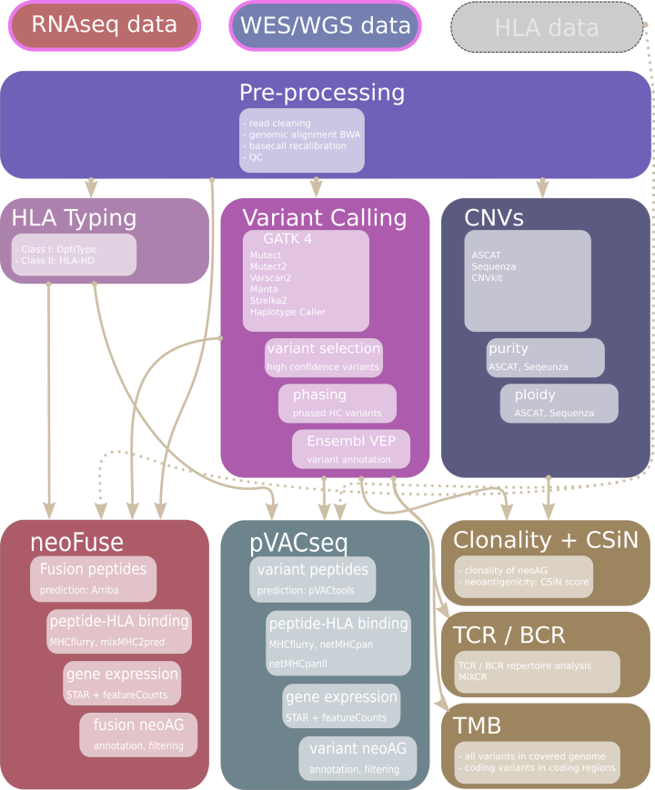

# Nextflow NeoEpitope predictions Pipeline

Pipeline takes fastq files from Tumor and Normal samples (WES or WGS) and optionally RNAseq from Tumor
to predict neoepitopes.

The pipeline uses the following tools:

* MuTect2
* MuTect1
* VarScan2
* Strelka2/Manta
* Sequenza
* ASCAT
* CNVkit
* OptiType
* HLA-HD
* pVACseq (NetMHCpan NetMHCpanEL MHCflurry MHCflurryEL NetMHCIIpan NetMHCIIpanEL DeepImmuno)
* NeoFuse
* mixMHC2pred
* mixcr
* blastp

It outputs a vcf file with the annotated and filtered SNPs and Indels, which
where called with each of the callers and a high confidence vcf file (hc) in
which only variants that were called by a minimum of 2 of the callers are listed.
All vcf files are annotated with VEP. In addition the germline variants are called
using HaploTypeCaller and a phased vcf for pVACseq is generated as well.
Copy number variations are analyzed using CNVkit, ASCAT, and sequenza. Tumor purity
is estimated by ASCAT and Sequenza and is used to derive the clonality measure for
the predicted neoantigens. Tumor mutational burden (TMB) is calculated for all
variants over the entire read covered genome and for coding variants on read covered
exons.
HLA class I and class II alleles are predicted with OptiType and HLA-HD.
Class I and Class II neoepitopes are predicted with pVACseq using netMHCpan,
netMHCIIpan and mhcflurry. In addition mixMHC2pred is used as complement Class II
neoepitope predictor. Fusion neoantigens are predicted with NeoFuse. All predicted neoeptiopes are searched via BLAST against protein databases (UniProt, RefSeq) to ensure that they are not present in a "non-aberrant" protein.
CSiN immunogenicity score is reported for Class I, Class II and combined neoepitopes.
A GBM model [1] is used to predict immunogenicity scores for MHC class I single nucleotide
variant (SNV) neoantigens 8-11 amino acid residues in length. Finally mixcr is run to predict the
TCR and BCR repertoire.

[1] <https://github.com/vincentlaboratories/neoag/>.



## Hardware recommendations

nextNEOpi is designed to run on high memory multi-core servers (recommended > 16 cores, min. 64GB RAM, > 5 TB of free disk space). For analysis of larger cohorts we strongly recommend running nextNEOpi on a HPC cluster with multiple compute nodes that meet these specifications.
However, by tuning the memory and CPU parameters in ```params.config``` and ```process.config``` it should also be possible to run nextNEOpi on systems with lower CPU and memory resources.

## 1. Installation

### 1.1 Nextflow

The command below may be used to install Nextflow. Please see also the installation instructions at:
<https://www.nextflow.io/index.html#GetStarted>

```
curl -s https://get.nextflow.io | bash

```

### 1.2 Analysis tools and software packages

The pipeline will install almost all required tools via Singularity images or conda environments. If preferred one can also use local installations of all tools (not recommended, please see `Manual installation` at the end of this document)

The software that needs to be present on the system is **Java** (minimum version 8, if running conda java version 17 or higher is needed), **Nextflow** (see above), **Singularity**, **Conda** (optional).

If you intend to run the pipeline with the `conda` profile instead of singularity, we recommend to install `mamba` (<https://github.com/mamba-org/mamba>)
to speed up the creation of conda environments. If you can not install `mamba` please set `conda.useMamba = false` for the `conda` profile in `conf/profiles.config`

**Optional but recommended:**
Due to license restrictions you may also need to download and install **HLA-HD** by your own, and set the installation path in ```conf/params.config```. _If HLA-HD is not available Class II neoepitopes will NOT be predicted_

### 1.3 References

The pipeline requires different reference files, indexes and databases:

please see ```conf/resources.config```

For each nextNEOpi version we prepared a bundle with all needed references, indexes and databases which can be obtained from:

<https://apps-01.i-med.ac.at/resources/nextneopi/>

the bundle is named to match the release version `nextNEOpi_<version>_resources.tar.gz`

e.g.:

<https://apps-01.i-med.ac.at/resources/nextneopi/nextNEOpi_1.4_resources.tar.gz>

download and extract the contents of the archive into the directory you specified for ```resourcesBaseDir``` in the ```conf/params.config``` file.

The structure should look as shown blow:

```
├── {resourcesBaseDir}
    ├── databases
    ├── ExomeCaptureKits
    └── references
```

**Notes**

1. You may also provide your own versions of these files. To do so, please change the ```conf/resources.config``` accordingly.
2. Due to license restriction, we do not provide a copy of the optional COSMIC database. If you also want to include COSMIC data, you may get a copy at <https://cancer.sanger.ac.uk/cosmic>
3. We provide the region and bait files for two different Exome capturing kits from Agilent:
   * SureSelect Human All Exon V6 exome
   * SureSelect Human All Exon V7 exome
   * Twist Human comprehensive exome

You may add your own region and bait files by defining an entry in ```conf/resources.config```

Refs:

* <https://gatk.broadinstitute.org/hc/en-us/articles/360036212652-Resource-Bundle>
* <https://console.cloud.google.com/storage/browser/genomics-public-data/resources/broad/hg38/v0/>
* <ftp://gsapubftp-anonymous@ftp.broadinstitute.org/bundle/>
* <https://gdc.cancer.gov/about-data/gdc-data-processing/gdc-reference-files>
* <https://www.gencodegenes.org/human/>

### 1.4 Testdata

If you want to test the pipeline using a working minimal test dataset you may download one from

<https://apps-01.i-med.ac.at/resources/nextneopi/nextNEOpi_testdata.tar.gz>

Please note that due to the limited read coverage `CNVkit` will not run successfully using this test dataset. Please run the
pipeline using the parameter `--CNVkit false` when testing with this dataset.

## 2. Usage

Before running the pipeline, the config files in the ```conf/``` directory may need to be edited. In the
```params.config``` parameters default settings are defined. The ```process.config```
is a template for the configuration of the single processes, you may check
the number of CPUs assigned for each process and adjust according to your systems capabilities.

Most pipeline parameters can be edited in the ```params.config``` file or changed on run time with command line options by using ```--NameOfTheParameter``` given in the ```params.config```.
References, databases should be edited in the ```resources.config``` file.

**Note**: nextNEOpi is currently written in nextflow DSL 1, which is only supported up to nextflow version 22.10.8, this means you need to pin the nextflow
version by setting the environment variable `NXF_VER=22.10.8`, in case you have installed a newer nextflow version.

```
NXF_VER=22.10.8 nextflow run nextNEOpi.nf --batchFile <batchFile_FASTQ.csv | batchFile_BAM.csv> -profile singularity|conda,[cluster] [-resume] -config conf/params.config
```

**Profiles:** conda or singularity

We highly recommend to use either the ```singularity``` or ```conda``` profile. You can specify one of the two profiles using the option ```-profile singularity``` or ```-profile conda```. This way you do not have to care about installing all the required software including all
its dependencies.

**Profiles:** cluster

We strongly recommend to run the pipeline on a HPC cluster. You can enable runs in cluster mode by using a profile named e.g. **cluster** and the option ```-profile singularity,cluster``` or ```-profile conda,cluster```

For an example Slurm cluster profile, please see ```profiles``` in ```conf/profiles.config```. You may uncomment and adjust the cluster profile to your scheduling system.

**Sequencing data input:**

Besides raw reads in **FASTQ** fromated files, input data may also be provided in **BAM** format.

**Note**: Per default DNA sequencing data will be treated as exome sequencing WES data. If whole genome sequencing is used, please specify ```--WES false``` on the command line or set ```WES = false``` in ```params.config```.

**RNA reads from tag seq library i.e. 3-prime end sequencing protocol**

```--RNA_tag_seq``` turns off the "--trna-vaf" and "--trna-cov" filter from pVACseq epitope filtering. It also turns of HLA typing from RNAseq data. 3-prime end sequencing does not cover the entire transcript.

**Mandatory arguments:**

```-config``` nextNEOpi config file, e.g. `-config conf/params.config`

```--accept_license``` accept the license terms

```--MIXCR_lic /path/to/mi.license``` OR ```--TCR false``` : a MiXCR license may be requested at https://licensing.milaboratories.com

```--batchFile```

Make sure that your batchFile CSV includes the column names as shown in the examples below as header line. See also `example_batchFile_FASTQ.csv` or `example_batchFile_BAM.csv`

**FASTQ raw reads**

* e.g.: CSV-file with Tumor/Normal WES/WGS, and optional RNAseq reads

 | sampleName | reads1 | reads2 | sampleType | HLAfile | sex |
 | ---------- |------- | ------ | ---------- | ------- | --- |
 | sample1 | reads_s1_t_1.fastq.gz | reads_s1_t_2.fastq.gz | tumor_DNA | | female
 | sample1 | reads_s1_n_1.fastq.gz | reads_s1_n_2.fastq.gz | normal_DNA | | female
 | sample1 | reads_s1_r_1.fastq.gz | reads_s1_r_2.fastq.gz | tumor_RNA | | female
 | sample2 | reads_s2_t_1.fastq.gz | reads_s2_t2.fastq.gz | tumor_DNA | /data/sample2_hla.txt | male
 | sample2 | reads_s2_n_1.fastq.gz | reads_s2_n_2.fastq.gz | normal_DNA | | male
 | sample2 | reads_s2_r_1.fastq.gz | | tumor_RNA | | male
 | sample3 | reads_s3_t_2.fastq.gz | reads_s3_t_2.fastq.gz | tumor_DNA | | female
 | sample3 | reads_s3_n_1.fastq.gz | reads_s3_n_2.fastq.gz | normal_DNA | | female
 | sample4 | reads_s4_t_1_1.fastq.gz | reads_s4_t_1_2.fastq.gz | tumor_DNA | | NA
 | sample4 | reads_s4_t_2_1.fastq.gz | reads_s4_t_2_2.fastq.gz | tumor_DNA | | NA
 | sample4 | reads_s4_n_1.fastq.gz | reads_s4_n_2.fastq.gz | normal_DNA | | NA
 | sample4 | reads_s4_r_1.fastq.gz | reads_s4_r_2.fastq.gz | tumor_RNA | | NA
 |... |

* CSV fields of the `batchFile`
* reads1: forward reads (can be fastq or gzipped fastq)
* reads2: reverse reads (if paired end sequencing was used, empty for single end)
* sampleType: one of `tumor_DNA, normal_DNA. tumor_RNA`
* HLAfile: optional file with HLA types (default: empty, example see `nextNEOpi_testdata.tar.gz`)
* sex: gender of the sample if known (female, male, xx, xy) or NA if unknown

A sample may have multiple read files for a single `sampleType`, nextNEOpi will merge them accordingly. As shown in the above example `sample4` has 2 fastq files for the `tumor_DNA`, in this cases `reads_1_1.fastq.gz` will be merged with `reads_2_1.fastq.gz`. The same applies to `reads2`.

**BAM files**

**Note:** If BAM files are used it is very much recommended that they also include also the unmapped and multimapping reads. These reads can be
helpful for HLA-typing.

* e.g.: CSV-file with Tumor/Normal WES/WGS, and optional RNAseq data:

 | sampleName | bam | sampleType | HLAfile | sex |
 | ---------- |-----| ---------- | ------- | --- |
 | sample1 | sample1_t.bam | tumor_DNA | | female
 | sample1 | sample1_n.bam | normal_DNA | | female
 | sample1 | sample1_r.bam | tumor_RNA | | female
 | sample2 | sample2_t.bam | tumor_DNA | | male
 | sample2 | sample2_n.bam | normal_DNA | | male

**Notes**

* _You can not use samples that have mixed single-end and paired-end DNA reads in tumor and normal. Both, tumor and normal DNA library types need to be either SE or PE for a given sample_

* in the ```HLAfile``` coulumn a user suppiled HLA types file may be specified for a given sample

* the ```sex``` column can be "XX", "female" or "Female", "XY", "male" or "Male". If not specified or "NA" the gender is inferred from the data.

* Please make sure your **```/tmp``` (or the directory set as ```$TMPDIR```) has a lot of free space (> 50GB, depending on input data size)**. You may change the tmp dir used by nextNEOpi by setting the parameter ```tmpDir``` in ```params.config``` or on the command line ```--tmpDir``` to a directory of your choice.

**Example run command with batchfile:**

```
nextflow run nextNEOpi.nf \
    --batchFile batchfile.csv \
    -config conf/params.config \
    --outputDir /data/results/nextNEOpi/myResults \
    --trim_adapters true \
    --trim_adapters_RNAseq true \
    --use_NetChop false \
    --tmpDir /my/huge/tmpDir \
    -profile singularity,cluster \
    -resume
```

**Optional argument:**

```--trim_adapters```         If true adapter sequences are automatically determined and will be trimmed from reads. If
                            ```--adapterSeq``` (string of adapter sequence) or ```--adapterSeqFile``` (fasta file with adapter sequences) is provided then adapters will be used as specified (no automatic detection).
                            Default: false

```--trim_adapters_RNAseq```  If true adapter sequences are automatically determined and will be trimmed from RNAseq reads. If
                            ```--adapterSeqRNAseq``` (string of adapter sequence) or ```--adapterSeqFileRNAseq``` (fasta file with adapter
                            sequences) is provided then adapters will be used as specified (no automatic detection).
                            Default: false

```--adapterSeq```            String of adapter sequence (see ```--trim_adapters```)
```--adapterSeqFile```        Fasta file with adapter sequence(s) (see ```--trim_adapters```)

```--adapterSeqRNAseq```      String of adapter sequence (see ```--trim_adapters_RNAseq```)
```--adapterSeqFileRNAseq```  Fasta file with adapter sequence(s) (see ```--trim_adapers_RNAseq```)

```--mutect2ponFile```        Panel of Normals file for Mutect2 (<https://gatk.broadinstitute.org/hc/en-us/articles/360035890631-Panel-of-Normals-PON>-)
                            Default: false

```--priorityCaller```        Set the variant caller used as base for the hc variants. Only variants that are confirmed by any of the two confirming
                            callers (e..g. mutect1, varscan) will be retained. M2 = mutect2, M1 = mutect1, VS = varscan, ST = strelka
                            Default: M2

```--minAD```                 Minimum allelic depth (reads covering a variant)
                            Default: 5

```--use_NetChop```            Use NetChop to generate peptides
                            Default: false

```--use_NetMHCstab```      Use NetMHCstab to predict the stability of peptide binding to MHC molecules
                            Default: true

```--TCR```                   Run mixcr for TCR prediction
                            Default: true

```--CNVkit```              Run CNVkit for detecting CNAs. Default: true

```--HLAHD_DIR``` Specify the path to your HLA-HD installation. Needed if Class II neoantigens should be predicted.

```--HLA_force_RNA``` Use only RNAseq for HLA typing. Default: false

```--HLA_force_DNA``` Use only WES/WGS for HLA typing. Default: false

```--run_HLAHD_RNA``` Run HLA-HD also on RNAseq. Highly accurate but can be very slow
                      on larger fastq files. Default: false

```--disable_OptiType``` Disable OptiType for HLA typing. If set, **HLA-HD** or a user supplied **custom HLA file** must be available (see ```--HLAHD_DIR``` and/or ```HLAfile``` field in the batchFile)

```--pVACseq_filter_set```   Can be one of [standard, relaxed, custom]. The ```standard``` filter set is using the pVACseq default filters. The ```relaxed``` filter set is filtering only for ic50 < 500 & rank < 2 & expn-val > 2. With filter set ```custom``` users can define a custom set of filters by providing the desired filters (space separated) using the ```--pVACseq_custom_filters``` option. E.g. ```--pVACseq_filter_set custom --pVACseq_custom_filters "--binding-threshold 250 --percentile-threshold 1"```. For filter options please see also the pVACseq manual. Default: standard

```--pVACseq_custom_filters``` See ```--pVACseq_filter_set```

**Further options:**        There are many more options that can be set in the params.conf file or specified on the commandline
                            (see ```conf/params.config```)

## 3. Output

The Pipeline stores its ouput in the following structure:

```
RESULTS
├── analyses
│   ├── Subject_01
│   │   ├── 01_preprocessing
│   │   ├── 02_alignments
│   │   ├── 03_baserecalibration
│   │   ├── 03_realignment
│   │   ├── 04_expression
│   │   ├── 04_variations
│   │   ├── 05_vep
│   │   ├── 06_proteinseq
│   │   ├── 07_MutationalBurden
│   │   ├── 08_CNVs
│   │   ├── 09_CCF
│   │   ├── 10_HLA_typing
│   │   ├── 11_Fusions
│   │   ├── 12_pVACseq
│   │   ├── 13_mixMHC2pred
│   │   ├── 14_CSiN
│   │   ├── 14_IGS
│   │   ├── 15_BCR_TCR
│   │   └── QC
│   ├── Subject_02
│   │   ├── [...]
│   ├── [...]
│   │   ├── [...]
│   ├── Subject_n
│   │   ├── [...]
├── Documentation
├── neoantigens
│   ├── Subject_ID
│   │   ├── Class_I
│   │   ├── Class_II
│   │   └── Final_HLAcalls
│   ├── Subject_02
│   │   ├── [...]
│   ├── [...]
│   │   ├── [...]
│   ├── Subject_n
│   │   ├── [...]
├── pipeline_info
│   └── icbi
└── supplemental
    ├── 00_prepare_Intervals
    └── 01_prepare_CNVkit
```

**4.** _**[Manual installaton: Not recommended]:**_

If you prefer local installation of the analysis tools please install the following software:

* FASTQC        (Version >= 0.11.8)
* FASTP         (Version >= v0.20.1)
* JAVA7   (Version 1.7)
* JAVA8   (Version => 1.17)
* BWA    (Version >= 0.7.17)
* SAMTOOLS   (Version >= 1.9)
* GATK3   (Version 3.8-0)
* GATK4   (Version >= 4.5.0.0)
* VARSCAN   (Version 2.4.6)
* MUTECT1   (Version 1.1.7) ---- optional
* BAMREADCOUNT  (Version 0.8.0)
* VEP    (Version v111)
* BGZIP
* TABIX
* BCFTOOLS
* MANTA
* STRELKA
* SAMBAMBA
* OPTITYPE
* PYTHON
* PERL
* CONDA
* YARA
* HLA-HD
* ALLELECOUNT
* RSCRIPT (R > 3.6.2)
* SEQUENZA (3.0)
* CNVkit

all these tools need be available via the $PATH environment variable. However, you still need Java, Nextflow, Conda and Singularity installed on your system.
